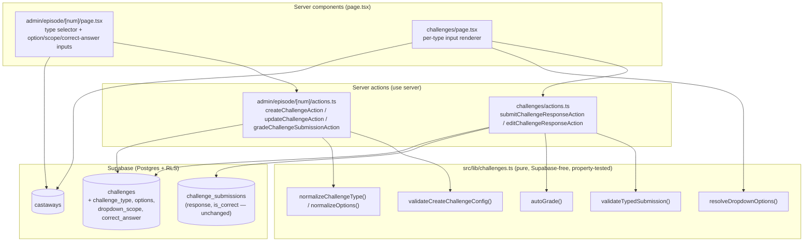
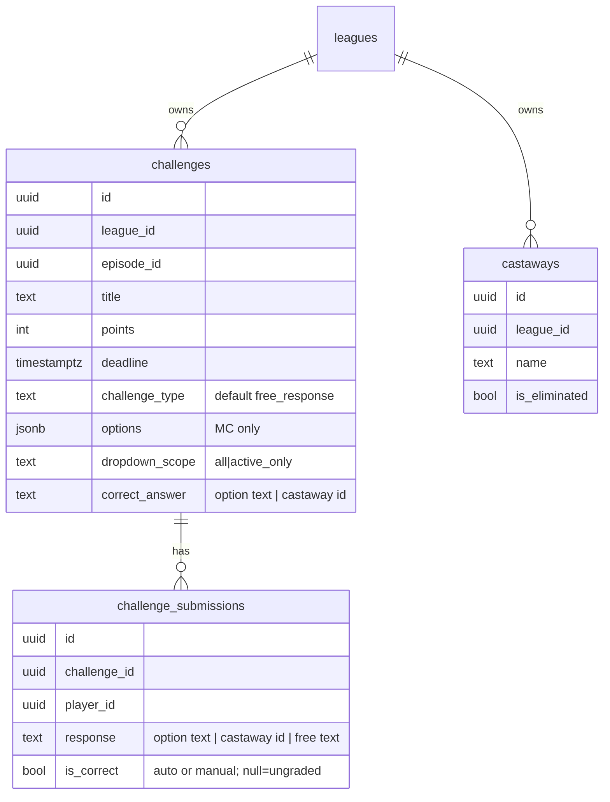
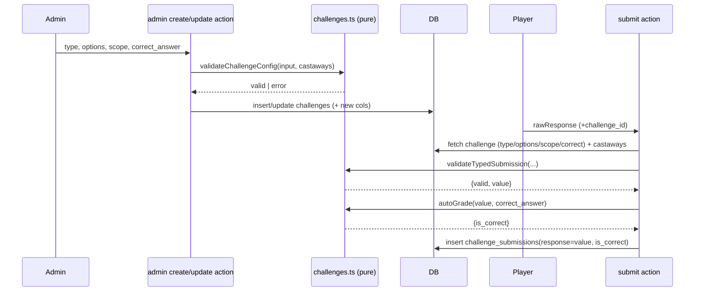

# Design Document: Configurable Challenge Types

## Overview

Today every weekly challenge is a free-text prompt: the player page renders a `<textarea>`, the player server action stores the raw string in `challenge_submissions.response`, and grading is entirely manual. This feature introduces a `challenge_type` attribute (`free_response`, `multiple_choice`, `survivor_dropdown`) chosen by the League_Admin at creation time, plus the configuration each type needs (multiple-choice options, survivor-dropdown scope, and an optional stored correct answer).

The design is constrained by three project rules that shape every decision below:

1. **Data-layer separation** (`.kiro/steering/structure.md`): all validation, normalization, and grading logic lives in `src/lib/challenges.ts` with zero Supabase imports; server actions in `src/app/**/actions.ts` combine Supabase I/O with lib validation and redirect with `?error=`/`?success=`; pages fetch and render.
2. **Backward compatibility** (Requirement 8): existing `challenges` rows have no type column today. The migration must default them to `free_response` and must not touch any existing `challenge_submissions` row.
3. **Single response column** (Requirement 6): all three types store their answer in the existing `challenge_submissions.response` TEXT column. No new submission columns.

Key design decisions, justified in the relevant sections:

- Multiple-choice options are stored as a **JSONB `options` column on `challenges`** (an ordered `text[]`-shaped array), not a separate table. See [Data Models](#data-models).
- The survivor-dropdown submission stores the **castaway id** in `response`; the castaway *name* is resolved at render time. This keeps grading stable even if a castaway is renamed and satisfies Requirement 6.2/6.4/6.6.
- **Auto-grade happens at submit time** inside the player server action, calling a pure `autoGrade` function. Manual admin override remains available and always wins (Requirement 7.4). Downstream scoring in `src/lib/scoring.ts` is unchanged — it already awards points only for `is_correct === true`.

This design covers requirements 1–10.

## Architecture

The feature spans the three existing layers with no new architectural concepts. All new decision logic is concentrated in the pure lib layer so it is exhaustively property-tested without Supabase.



### Layer responsibilities

- **`src/lib/challenges.ts`** — gains a `ChallengeType` union, an extended config input type, and pure functions for: type/scope/options normalization, create-config validation (options 2–10 unique ≤100 chars, scope enum, correct-answer membership), per-type submission validation, dropdown option resolution from castaway state, and `autoGrade`. No `is_eliminated` DB lookups — the caller passes castaway state in.
- **`src/app/league/[id]/admin/episode/[num]/actions.ts`** — `createChallengeAction` and `updateChallengeAction` are extended to read the type-specific FormData fields, call the lib validators, and persist the new columns. `gradeChallengeSubmissionAction` (manual override) is unchanged in shape. Requirement 9 conversion is handled by `updateChallengeAction`.
- **`src/app/league/[id]/admin/episode/[num]/page.tsx`** — the challenge creation/edit form gains a type selector plus conditionally-rendered option entry, scope selector, and correct-answer picker. It fetches league castaways to populate dropdown correct-answer options.
- **`src/app/league/[id]/challenges/page.tsx`** — the player page maps `challenge_type` to the correct input (textarea / radio group / castaway `<select>`), resolving dropdown options from live castaway state at render time (Requirement 4.6).
- **`src/app/league/[id]/challenges/actions.ts`** — `submitChallengeResponseAction` fetches the challenge's type/options/scope/correct_answer plus live castaways, calls `validateTypedSubmission`, computes `is_correct` via `autoGrade` when a correct answer exists, and inserts the submission.

## Components and Interfaces

### Pure logic additions — `src/lib/challenges.ts`

```typescript
export type ChallengeType = "free_response" | "multiple_choice" | "survivor_dropdown";
export type DropdownScope = "all" | "active_only";

export const CHALLENGE_TYPES: readonly ChallengeType[] =
  ["free_response", "multiple_choice", "survivor_dropdown"];

// A minimal castaway shape the lib needs (no Supabase types leak in)
export interface CastawayOption {
  id: string;
  name: string;
  is_eliminated: boolean;
}

// Extended challenge shape (columns added by migration; all nullable for back-compat)
export interface Challenge {
  id: string;
  league_id: string;
  episode_id: string;
  title: string;
  description: string | null;
  points: number;
  deadline: string;
  created_at: string;
  challenge_type: ChallengeType | null;   // null/absent => treated as free_response (Req 8.1)
  options: string[] | null;               // MC only
  dropdown_scope: DropdownScope | null;    // survivor_dropdown only
  correct_answer: string | null;           // MC: option text; dropdown: castaway id
}

export interface CreateChallengeInput {
  title: string;
  description: string;
  points: number;
  deadline: string;
  // New optional fields — omission implies free_response (Req 1.2)
  challengeType?: string;         // raw from FormData; validated/normalized
  options?: string[];             // MC raw option strings
  dropdownScope?: string;         // raw scope string
  correctAnswer?: string | null;  // MC option text OR castaway id
}

// --- Normalization -------------------------------------------------------
// Req 1.2, 8.1: absent/blank/unknown-at-read-time type resolves to free_response.
export function normalizeChallengeType(raw: string | null | undefined): ChallengeType;
// Req 3.2, 3.6, 9.6: absent scope resolves to active_only for dropdowns.
export function normalizeDropdownScope(raw: string | null | undefined): DropdownScope;
// Trims each option; drops entries empty after trim; preserves order (Req 2.1, 2.5).
export function normalizeOptions(raw: string[]): string[];

// --- Create/edit config validation --------------------------------------
// Covers Req 1.4, 2.1–2.7, 3.1, 3.6, 3.7, 3.8. Pure: castaway state passed in.
export function validateChallengeConfig(
  input: CreateChallengeInput,
  castaways: CastawayOption[]
): ChallengeValidationResult;

// --- Player-side option resolution ---------------------------------------
// Req 3.3/3.4/4.4/4.5/4.6/9.4: derive selectable options from live castaway state.
export function resolveDropdownOptions(
  scope: DropdownScope,
  castaways: CastawayOption[]
): CastawayOption[];

// --- Submission validation (per type) ------------------------------------
// Req 5.1–5.3, 6.5. Returns normalized value to store on success.
export function validateTypedSubmission(input: {
  type: ChallengeType;
  rawResponse: string;
  options: string[] | null;         // MC
  scope: DropdownScope | null;      // dropdown
  castaways: CastawayOption[];      // dropdown option universe
}): ChallengeValidationResult & { value?: string };

// --- Auto grading --------------------------------------------------------
// Req 7.1, 7.2, 7.6. Exact, case-sensitive, trimmed comparison.
// Returns is_correct=null when no correct answer is defined.
export function autoGrade(input: {
  submittedValue: string;
  correctAnswer: string | null;
}): { is_correct: boolean | null };
```

Existing exports (`validateCreateChallenge`, `validateChallengeSubmission`, `validateEditResponse`, `computeChallengePoints`) remain. `validateChallengeConfig` composes `validateCreateChallenge` for the shared title/points/deadline checks, then layers type-specific rules.

### Admin server actions — `admin/episode/[num]/actions.ts`

`createChallengeAction` (extended):
1. Read existing fields plus `challenge_type`, `options` (JSON-encoded array in a hidden field or repeated `option[]` fields), `dropdown_scope`, `correct_answer`.
2. Fetch league castaways (`id, name, is_eliminated`) — needed to validate a dropdown correct answer against scope (Req 3.8).
3. Call `validateChallengeConfig`. On failure, redirect with `?error=` (values are retained because the admin form is uncontrolled and the browser preserves them on back-navigation; the page also re-renders the error banner).
4. Normalize type/scope/options, then insert with the new columns. `free_response` stores `options=null, dropdown_scope=null, correct_answer=null`.

`updateChallengeAction` (extended, handles Requirement 9 conversion):
1. Load the challenge; if `deadline < now`, redirect with `"Cannot edit a challenge after its deadline."` (Req 9.5, existing behavior kept).
2. Otherwise validate the new config exactly like create, and update `challenge_type`, `options`, `dropdown_scope`, `correct_answer` alongside title/points/deadline.

`gradeChallengeSubmissionAction` (unchanged shape): manual override sets `is_correct` and always wins over any prior auto-grade (Req 7.4).

### Player server action — `challenges/actions.ts`

`submitChallengeResponseAction` (extended):
1. Existing membership + deadline + finalization + duplicate checks are unchanged (Req 5.5, 5.6, 10.1–10.4).
2. Fetch the challenge including `challenge_type, options, dropdown_scope, correct_answer`, and (only for dropdowns) the league castaways.
3. `type = normalizeChallengeType(challenge.challenge_type)`.
4. `validateTypedSubmission({...})` → on failure redirect with the exact required error message; the normalized `value` is what gets stored.
5. `is_correct = autoGrade({ submittedValue: value, correctAnswer: challenge.correct_answer }).is_correct`.
6. Insert `{ challenge_id, player_id, response: value, is_correct }`.

`editChallengeResponseAction` re-runs `validateTypedSubmission` + `autoGrade` for the same reasons; it must not run when the submission is already graded (existing rule).

### Player page — `challenges/page.tsx`

The single `<textarea>` block is replaced by a per-type renderer:

| Resolved type | Input rendered | Notes |
|---|---|---|
| `free_response` (incl. null/absent) | `<textarea maxlength=500>` | Req 4.1, 8.2 |
| `multiple_choice` | radio group over `options` | Req 4.2; if `<2` options, suppress input + show "This challenge is not answerable." (Req 4.3) |
| `survivor_dropdown` | `<select>` of `resolveDropdownOptions(scope, castaways)` (value=id, label=name) | Req 4.4–4.6; if empty, suppress + "No eligible options are available." (Req 4.7) |

For displaying an existing dropdown submission, the page resolves `response` (a castaway id) to a name via the fetched castaway list, falling back to the raw stored value if it no longer resolves (Req 6.4, 6.6).

### Admin form — `admin/episode/[num]/page.tsx`

Adds a type `<select>` (no default pre-selected, Req 1.1), and conditionally:
- MC: dynamic option text inputs (2–10) and an optional "correct option" selector.
- Dropdown: a scope selector (`all`/`active_only`) and an optional castaway correct-answer `<select>` sourced from league castaways.

## Data Models

### Schema change decision: JSONB `options` column vs separate table

**Decision: add a JSONB `options` column on `challenges`.** Justification:

- Options are a small (2–10), ordered, immutable-per-edit list wholly owned by one challenge. They are never queried independently, never joined, and never referenced by other rows. A child table would add a join, an ordering column, and its own RLS policy for zero query benefit.
- Storing an ordered JSON array trivially preserves entry order (Req 2.5) without an explicit `position` column.
- RLS stays simple: options inherit the challenge row's existing policies. A separate `challenge_options` table would require duplicating the challenge's league-scoped RLS.
- The correct answer for MC is stored as option *text* (Req 2.6, 6.3), so it round-trips against the same array with no foreign key.

Trade-off acknowledged: JSONB gives no DB-level uniqueness/length constraints on individual options. That is acceptable because option validity (2–10, unique case-insensitive, ≤100 chars) is enforced in the pure lib layer and is fully property-tested, consistent with how the codebase already validates structured input.

### `challenges` — new columns (migration `20240018`)

| Column | Type | Constraint | Purpose |
|---|---|---|---|
| `challenge_type` | `text` | `CHECK (challenge_type IN ('free_response','multiple_choice','survivor_dropdown'))`, `NOT NULL DEFAULT 'free_response'` | Req 1, 8 |
| `options` | `jsonb` | nullable | ordered MC option texts (Req 2.5) |
| `dropdown_scope` | `text` | `CHECK (dropdown_scope IN ('all','active_only'))`, nullable | Req 3 |
| `correct_answer` | `text` | nullable | MC option text or castaway id (Req 2.6, 3.6, 7) |

`challenge_submissions` is **unchanged** — `response` (TEXT), `is_correct` (bool nullable) already satisfy Requirement 6.

### Migration plan (backward compatible + reversible) — Req 8.3, 8.4

```sql
-- 20240018_add_challenge_types.sql
BEGIN;

ALTER TABLE challenges
  ADD COLUMN challenge_type text NOT NULL DEFAULT 'free_response'
    CHECK (challenge_type IN ('free_response','multiple_choice','survivor_dropdown')),
  ADD COLUMN options jsonb,
  ADD COLUMN dropdown_scope text
    CHECK (dropdown_scope IN ('all','active_only')),
  ADD COLUMN correct_answer text;

-- Every pre-existing row is now free_response via the DEFAULT (Req 8.1).
-- No UPDATE touches challenge_submissions (Req 8.3).
COMMIT;
```

- `DEFAULT 'free_response'` backfills existing rows atomically, so all current challenges become free-response with no data change to submissions (Req 8.1, 8.3).
- Wrapping in a single transaction gives all-or-nothing semantics: any failure rolls back every change (Req 8.4).
- Reversible down migration:

```sql
BEGIN;
ALTER TABLE challenges
  DROP COLUMN IF EXISTS correct_answer,
  DROP COLUMN IF EXISTS dropdown_scope,
  DROP COLUMN IF EXISTS options,
  DROP COLUMN IF EXISTS challenge_type;
COMMIT;
```

- No existing RLS policy references these columns, so the current `challenges` policies continue to apply unchanged.

### Response storage mapping (single `response` TEXT column) — Req 6

| Type | Stored in `response` | Rendered to player |
|---|---|---|
| `free_response` | raw trimmed text | the text |
| `multiple_choice` | the selected **option text** (must equal a stored option) | the text |
| `survivor_dropdown` | the selected **castaway id** | castaway *name* resolved at render; raw id if unresolved (Req 6.6) |

### Data + flow diagram





## Correctness Properties

*A property is a characteristic or behavior that should hold true across all valid executions of a system — essentially, a formal statement about what the system should do. Properties serve as the bridge between human-readable specifications and machine-verifiable correctness guarantees.*

These properties target the pure logic in `src/lib/challenges.ts`. They are derived from the prework classification and reflection (redundant criteria have been consolidated; UI-rendering, persistence, migration, and finalization criteria are handled by example/integration/smoke tests in the Testing Strategy, not here).

### Property 1: Missing challenge type normalizes to free_response

*For any* raw challenge-type value that is null, undefined, or blank after trimming, `normalizeChallengeType` returns `"free_response"`.

**Validates: Requirements 1.2, 8.1**

### Property 2: Unknown challenge type is rejected

*For any* non-empty string that is not one of `free_response`, `multiple_choice`, `survivor_dropdown`, `validateChallengeConfig` returns invalid with an error indicating the challenge type is invalid, and yields no persisted config.

**Validates: Requirements 1.4**

### Property 3: Valid multiple-choice configuration is accepted

*For any* multiple-choice config with between 2 and 10 options that are each 1–100 characters after trimming and unique under trim + case-insensitive comparison, `validateChallengeConfig` returns valid.

**Validates: Requirements 2.1**

### Property 4: Too-few multiple-choice options are rejected

*For any* option list that reduces to fewer than two non-empty options after trimming (including whitespace-only entries), a multiple-choice `validateChallengeConfig` returns invalid with the error "A multiple choice challenge requires at least two options."

**Validates: Requirements 2.2**

### Property 5: Duplicate multiple-choice options are rejected

*For any* option list containing two entries that are equal after trimming and case-insensitive comparison, a multiple-choice `validateChallengeConfig` returns invalid with the error "Multiple choice options must be unique."

**Validates: Requirements 2.3**

### Property 6: Too-many multiple-choice options are rejected

*For any* option list with more than ten non-empty options, a multiple-choice `validateChallengeConfig` returns invalid with an error indicating no more than ten options are allowed.

**Validates: Requirements 2.4**

### Property 7: Option order is preserved

*For any* raw option list, `normalizeOptions` returns the trimmed, non-empty entries in the same relative order they were entered (an order-preserving subsequence).

**Validates: Requirements 2.5**

### Property 8: Multiple-choice correct answer must be one of the options

*For any* multiple-choice config whose designated correct answer text does not equal any provided option, `validateChallengeConfig` returns invalid with an error indicating the correct answer must be one of the provided options.

**Validates: Requirements 2.7**

### Property 9: Missing dropdown scope normalizes to active_only

*For any* raw dropdown-scope value that is null, undefined, or blank after trimming, `normalizeDropdownScope` returns `"active_only"`.

**Validates: Requirements 3.2, 9.6**

### Property 10: Invalid dropdown scope is rejected

*For any* non-empty scope string that is not one of `all` or `active_only`, a survivor-dropdown `validateChallengeConfig` returns invalid with an error indicating the dropdown scope is invalid.

**Validates: Requirements 3.7**

### Property 11: Dropdown option resolution matches scope

*For any* set of castaways, `resolveDropdownOptions("all", castaways)` returns exactly the full set of castaways (by id), and `resolveDropdownOptions("active_only", castaways)` returns exactly those castaways whose `is_eliminated` is false.

**Validates: Requirements 3.3, 3.4, 4.4, 4.5, 4.6, 9.4**

### Property 12: Dropdown active_only correct answer must be an active castaway

*For any* survivor-dropdown config with scope `active_only` whose designated correct answer is the id of a castaway with `is_eliminated` true, `validateChallengeConfig` returns invalid with an error indicating the correct answer is not an active castaway.

**Validates: Requirements 3.8**

### Property 13: Empty or whitespace answers are rejected for every type

*For any* challenge type and *any* response consisting only of whitespace (including the empty string), `validateTypedSubmission` returns invalid with the error "Response is required." and yields no storable value.

**Validates: Requirements 5.1**

### Property 14: Multiple-choice submissions must exactly match a stored option

*For any* multiple-choice challenge and *any* response that is not exactly (case-sensitive) equal to one of the stored options, `validateTypedSubmission` returns invalid with the error "Selected option is not valid for this challenge."

**Validates: Requirements 5.2, 6.5**

### Property 15: Survivor-dropdown submissions must match a scoped castaway id

*For any* survivor-dropdown challenge and *any* response that is not the id of a castaway included in the challenge's resolved scope, `validateTypedSubmission` returns invalid with the error "Selected castaway is not valid for this challenge."

**Validates: Requirements 5.3, 6.5**

### Property 16: A valid submission returns the correct storable value

*For any* valid submission of any type, `validateTypedSubmission` returns valid with a non-empty `value` such that: for free response it is the trimmed text; for multiple choice it is exactly one of the stored options; and for survivor dropdown it is the id of exactly one castaway in the resolved scope.

**Validates: Requirements 5.4, 6.1, 6.2, 6.3**

### Property 17: Auto-grade is exact, case-sensitive, and trimmed

*For any* submitted value and correct answer, `autoGrade` returns `is_correct = true` when the trimmed submitted value equals the trimmed correct answer under case-sensitive comparison, `false` when a correct answer is defined but does not match, and `null` when no correct answer is defined.

**Validates: Requirements 7.1, 7.2, 7.3, 7.6**

### Property 18: Dropdown display resolution falls back safely

*For any* stored response value and *any* set of castaways, the display resolver returns the matching castaway's name when the value resolves to a castaway id, otherwise returns the raw stored value, and never throws.

**Validates: Requirements 6.6**

## Error Handling

Error handling follows the established codebase pattern: pure validators return `{ valid: false, error }`; server actions translate that into a `redirect(...?error=<message>)`; success paths `revalidatePath` and optionally redirect with `?success=`.

- **Invalid create/edit config** (Req 1.4, 2.2–2.4, 2.7, 3.7, 3.8): `validateChallengeConfig` returns the exact required message; the admin action redirects to the episode admin page with `?error=`. No row is inserted/updated (validation runs before any Supabase write), satisfying "persist no challenge record." Entered values persist because the admin form is uncontrolled (browser preserves inputs on back-navigation) and the error banner re-renders.
- **Invalid submission** (Req 5.1–5.3, 6.5): `validateTypedSubmission` returns the exact required message; the player action redirects with `?error=` and performs no insert, leaving any prior submission untouched (the duplicate-submission guard already prevents overwrite).
- **Deadline / finalization** (Req 5.5, 9.5, 10.1–10.4): existing guards are preserved unchanged — `validateChallengeSubmission` for submit, the `deadline < now` check in `updateChallengeAction` for edits/conversions ("Cannot edit a challenge after its deadline."), and the `episodes.is_finalized` check ("This episode has been finalized. No more submissions allowed.").
- **Unanswerable / no-options rendering** (Req 4.3, 4.7): the player page detects `<2` MC options or an empty resolved dropdown set and suppresses the input, rendering an error banner instead of a form.
- **Unresolvable stored dropdown id** (Req 6.6): the display resolver falls back to the raw stored value rather than throwing, so historical submissions never break the page.
- **Migration failure** (Req 8.4): the migration is wrapped in a single `BEGIN/COMMIT` transaction; any failure rolls back all column additions, and the migration runner surfaces the SQL error.
- **Supabase write failure**: unchanged — actions redirect with a generic "Failed to …" message.

## Testing Strategy

This feature is verified at three levels: **pure unit/property tests** for the decision logic, **live-Supabase integration tests** for the new columns, auto-grade, conversion, and backward compatibility, and a **migration smoke test**. Property-based testing **is appropriate** for the pure core (type/scope/option normalization, config validation, submission validation, auto-grading, and option/name resolution) — large input spaces with clear universal properties. UI rendering, persistence, migration, RLS, and episode-finalization behavior are **not** suitable for PBT and are covered by example and integration tests instead.

### Dual approach

- **Property tests** (`fast-check`, in `src/test/challenges.test.ts`) cover Properties 1–18 above — one property-based test per property.
- **Unit / example tests** cover concrete affordances and rendering-adjacent logic: type selector shows exactly three options none pre-selected (Req 1.1), valid config of each type is accepted (Req 1.3, 3.1, 3.6, 9.1, 9.2), free-response/MC/dropdown input rendering and suppression branches (Req 4.1–4.7, 6.4, 8.2), and reading a legacy submission returns stored values unchanged (Req 8.5).
- **Integration tests** (live-Supabase, in `src/test/integration/challenges.test.ts`) verify the new columns, auto-grade, conversion, and backward compatibility end-to-end against a real database. Detailed below.
- **Smoke tests** verify the migration only `ALTER`s `challenges`, never writes `challenge_submissions` (Req 8.3), and is transactional/atomic (Req 8.4).
- **Existing coverage reused**: the deadline property (`validateChallengeSubmission`) already validates Req 5.5/9.5/10.1 across all types, and the `computeChallengePoints` property already validates Req 7.5. No new PBT is written for these; the tests are noted as covering the new requirement IDs.

### Property test configuration

- Library: `fast-check` (already in use in `src/test/challenges.test.ts`).
- Each property-based test runs a **minimum of 100 iterations** (`{ numRuns: 100 }`). Note: the existing challenge tests use `numRuns: 20`; new property tests for this feature will use 100 per the workflow requirement.
- Property tests do **not** implement PBT from scratch and do **not** mock Supabase — they call the pure lib functions directly.
- Each property test is tagged with a comment referencing its design property in the format:
  `// Feature: configurable-challenge-types, Property {number}: {property_text}`
  and a `// Validates: Requirements X.Y` line.

### Generators

- **Castaway sets**: arrays of `{ id: uuid-like string, name, is_eliminated: boolean }`, including empty sets and all-eliminated sets (covers Req 4.7 edge case and Property 11 emptiness).
- **Option lists**: arrays of strings including whitespace-only entries, case/whitespace variants (for duplicate detection), lengths spanning 0–15 and character lengths spanning 0–120 (covers Properties 3–8 boundaries).
- **Responses**: whitespace-only strings, arbitrary text, exact/variant matches of options and castaway ids (covers Properties 13–17).
- **Type/scope raw values**: valid enum members, null/undefined/blank, and arbitrary non-member strings (covers Properties 1, 2, 9, 10).

### Integration testing (live Supabase)

This feature must be verified against a real database because its correctness depends on the new `challenges` columns, RLS, auto-grade at submit time, and backward compatibility with existing rows — none of which the pure unit/property tests exercise. The repo already has an integration harness (`vitest.integration.config.ts`, `node` env, `fileParallelism: false`, 30s timeout, run via `npm run test:integration`) targeting a dedicated test league (season 99). New work extends that harness rather than inventing a new one.

**Helper changes — `src/test/integration/helpers/actions.ts`:**

The existing challenge helpers replicate the server-action query→validate→mutate pattern with the admin client. They are extended (not replaced) so existing tests keep passing:

- `createChallenge(...)` gains optional typed parameters: `{ challengeType?, options?, dropdownScope?, correctAnswer? }`. When omitted it behaves exactly as today (free response), preserving the current call sites in `challenges.test.ts`.
- `submitChallengeResponse(...)` is extended to fetch the challenge's `challenge_type`/`options`/`dropdown_scope`/`correct_answer` (plus league castaways for dropdowns), run `validateTypedSubmission`, and set `is_correct` via `autoGrade` before insert — mirroring the real `submitChallengeResponseAction`.
- New helper `updateChallenge(challengeId, patch)` replicates the admin `updateChallengeAction` (type conversion + deadline guard) for Requirement 9.
- `gradeSubmission(...)` is unchanged (manual override).

**Test cases added to `src/test/integration/challenges.test.ts`:**

| Scenario | Requirements |
|---|---|
| Create a `multiple_choice` challenge; row persists `challenge_type='multiple_choice'` and ordered `options` JSONB | 1.3, 2.5 |
| Create a `survivor_dropdown` challenge with `dropdown_scope='active_only'`; row persists type + scope | 1.3, 3.1, 3.5 |
| Create with omitted type; row persists `challenge_type='free_response'` (default) | 1.2 |
| MC submission stores the selected option text in `response` | 6.1, 6.3 |
| Dropdown submission stores the castaway **id** in `response` | 6.1, 6.2 |
| MC challenge with `correct_answer` set: matching submission auto-grades `is_correct=true`, non-matching `false` | 7.1 |
| Dropdown challenge with `correct_answer` set (castaway id): auto-grade true/false at submit | 7.1 |
| Challenge with no `correct_answer`: submission leaves `is_correct=null` | 7.2, 7.3 |
| Manual `gradeSubmission` override persists and wins over a prior auto-grade | 7.4 |
| Submit to a non-existent / closed challenge returns an error, inserts no row | 5.6 |
| Convert an existing free-response challenge to `survivor_dropdown` (`active_only`) before deadline; type+scope updated | 9.1, 9.2, 9.3 |
| Attempt conversion after deadline returns "Cannot edit a challenge after its deadline." and leaves the row unchanged | 9.5 |
| Finalized-episode submission rejected with the exact finalized message | 10.2 |
| Open, non-finalized challenge accepts a submission | 10.3 |
| Rejected submit (deadline/finalized) leaves previously accepted submissions unchanged | 10.4 |
| Correct challenge points appear in the leaderboard for an auto-graded correct submission | 7.5 (end-to-end) |

**Backward-compatibility check:** a challenge row inserted directly with no type columns (simulating a pre-migration row) is read and submitted against as free response, and its existing submission's `response`/`is_correct` are returned unchanged (Req 8.1, 8.5).

**RLS:** the new columns inherit the existing `challenges` row policies (no new policy needed). A scoped-client test confirms a league member can read a typed challenge and its options, and a non-member cannot — consistent with the existing `rls.test.ts` patterns.

**Migration smoke test** (`src/test/integration/smoke.test.ts` or a dedicated migration check): after migration, `challenges` has the four new columns with the expected defaults/constraints, all pre-existing challenge rows read as `free_response`, and no `challenge_submissions` row was modified (Req 8.3, 8.4).

**Bug protocol:** if any integration test asserts correct per-requirement behavior but fails against the implementation as it is built, follow the existing `KNOWN_BUGS.md` convention — mark it `it.fails()` with a `// BUG: … — Req X.Y` comment and log an entry — rather than weakening the assertion.
