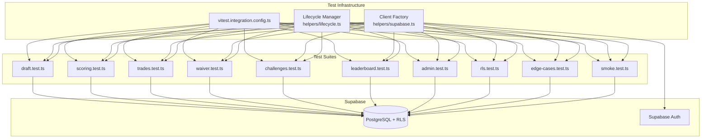
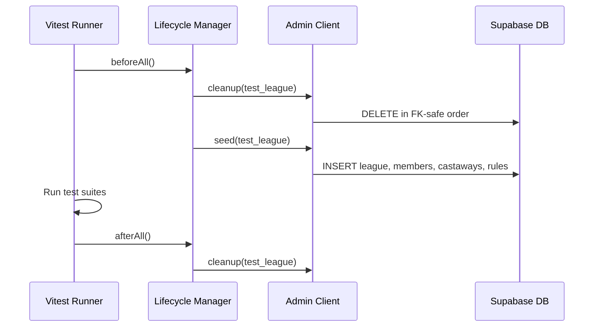

# Design Document: Integration Test Suite

## Overview

This design specifies the architecture for a comprehensive integration test suite that exercises the Fantasy Survivor application's Supabase queries, Row Level Security policies, server action logic, and full data flows against a live Supabase database. The suite runs independently from the existing unit tests via a dedicated Vitest configuration and targets a dedicated test league (season 99) to avoid polluting production data.

The integration tests complement the existing unit tests (which cover pure `src/lib/` functions) by verifying that database operations, RLS policies, and multi-step workflows produce correct results when executed against real Supabase infrastructure.

### Design Decisions

1. **Separate Vitest config** — Integration tests use `vitest.integration.config.ts` with `node` environment (no jsdom) and 30s timeout to accommodate network round-trips. This avoids conflicts with the unit test setup that imports `@testing-library/jest-dom`.

2. **Replicate server action patterns** — Since server actions use `redirect()` and `revalidatePath()` (Next.js-specific), tests replicate the query → validate → mutate pattern directly using Supabase clients rather than invoking server action functions.

3. **Admin client + scoped clients** — An admin client (service_role key, bypasses RLS) handles setup/teardown/verification. Scoped clients (anon key + signInWithPassword) test RLS enforcement.

4. **Deterministic test data** — Fixed league name ("Integ Test League"), season 99, 10 players, 30 castaways. This makes assertions predictable and cleanup safe.

5. **FK-safe cleanup** — Deletion order respects foreign key constraints (children before parents), scoped exclusively to the test league.

## Architecture



### Test Execution Flow



## Components and Interfaces

### 1. Vitest Integration Configuration (`vitest.integration.config.ts`)

```typescript
// Root-level config file
import { defineConfig } from "vitest/config";
import path from "path";

export default defineConfig({
  test: {
    environment: "node",
    globals: true,
    include: ["src/test/integration/**/*.test.ts"],
    testTimeout: 30000,
    // No setupFiles — avoids jsdom-specific @testing-library/jest-dom
  },
  resolve: {
    alias: {
      "@": path.resolve(__dirname, "./src"),
    },
  },
});
```

### 2. Client Factory (`src/test/integration/helpers/supabase.ts`)

```typescript
interface TestClientFactory {
  // Admin client — bypasses RLS via service_role key
  getAdminClient(): SupabaseClient;

  // Scoped client — authenticated as a specific test user, subject to RLS
  getScopedClient(email: string, password: string): Promise<SupabaseClient>;

  // User management helpers
  createTestUser(email: string, password: string): Promise<string>; // returns UUID
  getTestUser(email: string): Promise<{ id: string } | null>;
  deleteTestUser(id: string): Promise<void>;
}
```

### 3. Lifecycle Manager (`src/test/integration/helpers/lifecycle.ts`)

```typescript
interface LifecycleManager {
  // Cleanup — deletes all test league data in FK-safe order
  cleanup(): Promise<void>;

  // Seed — creates test league with full configuration
  seed(): Promise<{ leagueId: string; playerIds: string[]; castawayIds: string[] }>;

  // Get current test league ID
  getLeagueId(): Promise<string>;

  // Get test player IDs (ordered by joined_at)
  getPlayerIds(): Promise<string[]>;

  // Get test castaway IDs (ordered alphabetically)
  getCastawayIds(): Promise<string[]>;
}
```

### 4. Test Helper Utilities (`src/test/integration/helpers/actions.ts`)

```typescript
// Replicates server action patterns using direct Supabase queries
interface TestActionHelpers {
  // Draft actions
  startLiveDraft(leagueId: string): Promise<{ draftId: string }>;
  makeDraftPick(draftId: string, playerId: string, castawayId: string): Promise<{ error?: string }>;
  startAutoDraft(leagueId: string): Promise<{ totalPicks: number }>;

  // Episode actions
  addEpisodeEvent(leagueId: string, episodeNum: number, castawayId: string, scoringRuleId: string): Promise<{ eventId: string; error?: string }>;
  finalizeEpisode(leagueId: string, episodeNum: number): Promise<{ error?: string }>;
  unfinalizeEpisode(leagueId: string, episodeNum: number): Promise<{ error?: string }>;
  removeEpisodeEvent(eventId: string): Promise<{ error?: string }>;
  eliminateCastaway(castawayId: string, episodeNum: number): Promise<void>;

  // Trade actions
  proposeTrade(leagueId: string, proposerId: string, receiverId: string, proposerCastaway: string, receiverCastaway: string): Promise<{ tradeId: string; error?: string }>;
  acceptTrade(tradeId: string, receiverId: string): Promise<{ error?: string }>;
  rejectTrade(tradeId: string, receiverId: string): Promise<{ error?: string }>;
  cancelTrade(tradeId: string, proposerId: string): Promise<{ error?: string }>;

  // Waiver actions
  submitWaiverClaim(leagueId: string, playerId: string, castawayId: string, dropCastawayId: string, bidAmount: number): Promise<{ claimId: string; error?: string }>;
  processWaivers(leagueId: string): Promise<{ error?: string }>;

  // Challenge actions
  createChallenge(leagueId: string, episodeId: string, title: string, points: number, deadline: string): Promise<{ challengeId: string; error?: string }>;
  submitChallengeResponse(challengeId: string, playerId: string, response: string): Promise<{ submissionId: string; error?: string }>;
  gradeSubmission(submissionId: string, isCorrect: boolean): Promise<void>;
}
```

### 5. File Structure

```
src/test/integration/
├── helpers/
│   ├── supabase.ts          # Client factory (admin + scoped)
│   ├── lifecycle.ts         # Cleanup + seed routines
│   ├── actions.ts           # Server action replication helpers
│   └── constants.ts         # Test league config, user credentials
├── draft.test.ts            # Live draft + auto draft tests
├── scoring.test.ts          # Episode events, finalization, consolation
├── trades.test.ts           # Trade lifecycle + points boundaries
├── waiver.test.ts           # Waiver claims, processing, budget
├── challenges.test.ts       # Challenge CRUD, submissions, grading
├── leaderboard.test.ts      # Points integrity, ranking, multi-week
├── admin.test.ts            # Admin CRUD operations
├── rls.test.ts              # RLS policy enforcement
├── edge-cases.test.ts       # Boundary conditions, race conditions
├── smoke.test.ts            # Full season end-to-end
└── KNOWN_BUGS.md            # Bug tracking document
```

## Data Models

### Test League Configuration (Constants)

```typescript
export const TEST_LEAGUE = {
  name: "Integ Test League",
  season_number: 99,
  roster_size: 2,
  consolation_points: 2,
  waiver_budget: 100,
  draft_mode: "live" as const,
  pick_timer_seconds: 300,
};

export const TEST_PLAYERS = Array.from({ length: 10 }, (_, i) => ({
  email: `integ-player-${i + 1}@test.local`,
  password: "TestPassword123!",
  display_name: `Player ${i + 1}`,
  is_admin: i === 0, // Player 1 is admin
}));

export const TEST_CASTAWAYS = Array.from({ length: 30 }, (_, i) => ({
  name: `Castaway-${String(i + 1).padStart(2, "0")}`,
  tribe: i < 10 ? "Alpha" : i < 20 ? "Beta" : "Gamma",
}));
```

### Cleanup Order (FK-safe)

```
1. challenge_submissions (FK → challenges)
2. challenges (FK → leagues, episodes)
3. waiver_claims (FK → leagues)
4. episode_events (FK → episodes)
5. episodes (FK → leagues)
6. trades (FK → leagues)
7. team_assignments (FK → leagues)
8. draft_picks (FK → drafts)
9. draft_preferences (FK → leagues)
10. drafts (FK → leagues)
11. scoring_rules (FK → leagues)
12. castaways (FK → leagues)
13. league_members (FK → leagues)
14. leagues (root)
```

### Database Tables Exercised

| Table | Operations Tested |
|-------|------------------|
| leagues | CRUD, config updates |
| league_members | Insert (join), RLS read |
| castaways | CRUD, elimination, restoration |
| scoring_rules | CRUD, ON DELETE SET NULL |
| drafts | Create, status transitions |
| draft_picks | Insert, sequential numbering |
| draft_preferences | Insert, rank ordering |
| team_assignments | Insert/delete via draft/trade/waiver |
| episodes | Auto-create, finalize/unfinalize |
| episode_events | Insert/delete, player_id stamping |
| trades | Full lifecycle (pending→approved/rejected) |
| waiver_claims | Submit, process, status transitions |
| challenges | CRUD, deadline enforcement |
| challenge_submissions | Submit, grade, duplicate prevention |

## Correctness Properties

*A property is a characteristic or behavior that should hold true across all valid executions of a system — essentially, a formal statement about what the system should do. Properties serve as the bridge between human-readable specifications and machine-verifiable correctness guarantees.*

### Property 1: Snake Order Correctness

*For any* set of N players (N ≥ 1) and roster_size R (R ≥ 1), the generated snake order SHALL have length N × R, with odd-indexed rounds (0, 2, 4...) ordering players ascending and even-indexed rounds (1, 3, 5...) ordering players descending.

**Validates: Requirements 4.2, 5.1**

### Property 2: Draft Pick Validation

*For any* active draft and any player whose index does not match the current_pick_index in the snake order, attempting to make a pick SHALL return an error; and *for any* castaway_id that already exists in draft_picks for the current draft, attempting to pick that castaway SHALL return an error.

**Validates: Requirements 4.6, 4.7**

### Property 3: Draft Completion Invariants

*For any* completed draft with N players, roster_size R, and C available castaways, each player SHALL have exactly min(R, ⌊C/N⌋) or min(R, ⌈C/N⌉) team_assignments with source = "draft", and the total number of assigned castaways SHALL equal min(N × R, C).

**Validates: Requirements 4.9, 4.11**

### Property 4: Draft Assignment Integrity

*For any* completed draft, every draft_pick row SHALL have a corresponding team_assignment row with matching player_id, castaway_id, source = "draft", and points_from_episode = 1; and all assigned castaway_ids across all team_assignments with source = "draft" SHALL be unique.

**Validates: Requirements 5.4, 5.5**

### Property 5: Auto-Draft Pick Selection

*For any* player with draft preferences during an auto draft, their pick SHALL be the highest-ranked castaway (lowest rank number) from their preference list that has not been drafted by a prior pick; and *for any* player without preferences, their pick SHALL be the castaway with the earliest alphabetical name among undrafted castaways.

**Validates: Requirements 5.2, 5.3**

### Property 6: Finalization Player Attribution

*For any* finalized episode, every episode_event in that episode SHALL have its player_id set to the player who currently owns the event's castaway via an active team_assignment at the time of finalization.

**Validates: Requirements 6.3**

### Property 7: Consolation Point Lifecycle

*For any* eliminated castaway with eliminated_episode = E and an active team_assignment with points_from_episode = P, the number of consolation events SHALL equal the count of finalized episodes with number > E AND number ≥ P, each with points equal to the league's consolation_points value and scoring_rule_id = NULL. When an episode is unfinalized, its consolation events SHALL be deleted while manually-added events (scoring_rule_id IS NOT NULL) SHALL remain.

**Validates: Requirements 6.4, 6.5, 6.6, 10.5**

### Property 8: Trade Validation

*For any* trade proposal where the proposer does not own the offered castaway, the operation SHALL return an error containing "You do not own the castaway you are offering"; and *for any* trade proposal involving an eliminated castaway, the operation SHALL return an error containing "Eliminated castaways cannot be traded".

**Validates: Requirements 7.5, 7.6**

### Property 9: Trade Acceptance Assignment Swap

*For any* accepted trade in a league with latest finalized episode number F, the proposer SHALL receive a team_assignment for the receiver's castaway with source = "trade" and points_from_episode = F + 1, and the receiver SHALL receive a team_assignment for the proposer's castaway with source = "trade" and points_from_episode = F + 1 (defaulting to 1 if F = 0).

**Validates: Requirements 7.2**

### Property 10: Points Attribution Integrity Across Transfers

*For any* castaway involved in a trade or waiver, the sum of episode_event points earned by the original owner (episodes before transfer, attributed via player_id at finalization) plus points earned by the new owner (episodes from points_from_episode onward) SHALL equal the castaway's total episode_event points across all finalized episodes — no points are duplicated or lost.

**Validates: Requirements 7.8, 10.2, 10.3, 10.7**

### Property 11: Waiver Pool Composition

*For any* league state, the waiver wire pool SHALL contain exactly those castaways that are (a) not eliminated (is_eliminated = false) AND (b) not assigned to any player's team (no active team_assignment exists for that castaway in the league).

**Validates: Requirements 8.1**

### Property 12: Waiver Claim Validation

*For any* waiver claim where bid_amount exceeds the player's waiver_budget_remaining, the operation SHALL return an error containing "exceeds"; *for any* claim targeting an eliminated castaway, the operation SHALL return an error containing "Eliminated castaways"; and *for any* claim dropping a castaway the player does not own, the operation SHALL return an error containing "do not own".

**Validates: Requirements 8.3, 8.4, 8.5**

### Property 13: Waiver Processing Resolution

*For any* set of pending waiver claims targeting the same castaway, the winner SHALL be the claimant with the highest bid_amount (using lowest priority number as tiebreak for equal bids); all other claimants SHALL be marked "lost"; the winner's waiver_budget_remaining SHALL be reduced by their bid_amount; and losing bidders' budgets SHALL remain unchanged. If a player's winning claim uses a drop_castaway, all their other pending claims using the same drop_castaway SHALL be marked "lost".

**Validates: Requirements 8.6, 8.7, 13.3**

### Property 14: Total Score Composition

*For any* player in the league, their total score SHALL equal: (sum of episode_event.points where episode_event.player_id = player_id) + (consolation_points_per_episode × count of finalized episodes after elimination for each eliminated castaway with active team_assignment) + (sum of challenge points for submissions where is_correct = true).

**Validates: Requirements 10.1**

### Property 15: Standard Competition Ranking

*For any* set of player scores, the leaderboard SHALL assign ranks using standard competition ranking: tied players receive the same rank, and the next rank after K tied players at rank R is R + K (e.g., scores [100, 100, 80] produce ranks [1, 1, 3]).

**Validates: Requirements 10.6**

## Error Handling

### Test Infrastructure Errors

| Error Condition | Handling Strategy |
|----------------|-------------------|
| Missing env vars (SUPABASE_URL, SERVICE_ROLE_KEY) | Fail fast with descriptive error before any tests execute |
| Supabase connection failure | Retry once, then fail with connection error message |
| Cleanup timeout (>10s) | Fail with timeout error, suggest manual cleanup |
| Auth user creation failure | Log error, skip dependent tests |

### Test Execution Errors

| Error Condition | Handling Strategy |
|----------------|-------------------|
| Unexpected database state | Log actual state, fail assertion with clear diff |
| RLS violation (expected) | Assert error is non-null and data is null |
| RLS violation (unexpected) | Fail with details about which policy blocked |
| Server action validation error | Assert error message contains expected substring |
| Timeout on individual test | Fail with 30s timeout message |

### Bug Discovery Protocol

| Scenario | Action |
|----------|--------|
| Test discovers bug (assertion fails against current behavior) | Use `it.fails()` with `// BUG:` comment, add to KNOWN_BUGS.md |
| Test cannot be fully implemented yet | Use `it.todo()` as placeholder |
| Bug is fixed (it.fails test starts passing) | Convert to standard `it()`, remove from KNOWN_BUGS.md |

## Testing Strategy

### Dual Testing Approach

- **Unit tests** (existing, `src/test/*.test.ts`): Test pure `src/lib/` functions with fast-check property-based testing. No database, no network. Run via `npm run test`.
- **Integration tests** (new, `src/test/integration/*.test.ts`): Test database operations, RLS policies, and multi-step workflows against live Supabase. Run via `npm run test:integration`.

### Property-Based Testing in Integration Tests

Property-based testing (PBT) with `fast-check` is applicable to a subset of integration test scenarios where universal properties can be verified across generated inputs. However, most integration tests are inherently example-based because they test specific database state transitions with concrete data.

**Where PBT applies in integration tests:**
- Snake order generation (Property 1) — already covered by unit tests, but can verify end-to-end
- Waiver processing resolution (Property 13) — generate random bid amounts and priorities
- Standard competition ranking (Property 15) — generate random score arrays
- Points attribution integrity (Property 10) — generate random episode/trade sequences

**Where PBT does NOT apply (use example-based integration tests):**
- RLS policy enforcement — specific access patterns with concrete users
- Server action replication — specific multi-step workflows
- Full season smoke test — sequential scenario with fixed data
- Admin CRUD operations — specific operations with concrete inputs
- Edge cases — specific boundary conditions

### Property Test Configuration

- Library: `fast-check` (already in devDependencies)
- Minimum iterations: 100 per property test
- Tag format: `// Feature: integration-tests, Property {N}: {title}`
- Location: Within relevant test files (e.g., Property 1 in `draft.test.ts`)

### Test Execution Order

Integration test files are independent and can run in parallel, except:
- `smoke.test.ts` must run in isolation (it performs its own cleanup/seed cycle)
- Each test file uses `beforeAll` to ensure clean state for its domain

### npm Script Addition

```json
{
  "test:integration": "vitest --run --config vitest.integration.config.ts"
}
```

### Unit Test Config Update

The existing `vitest.config.ts` must exclude integration tests:

```typescript
test: {
  exclude: ["src/test/integration/**"],
  // ... existing config
}
```
