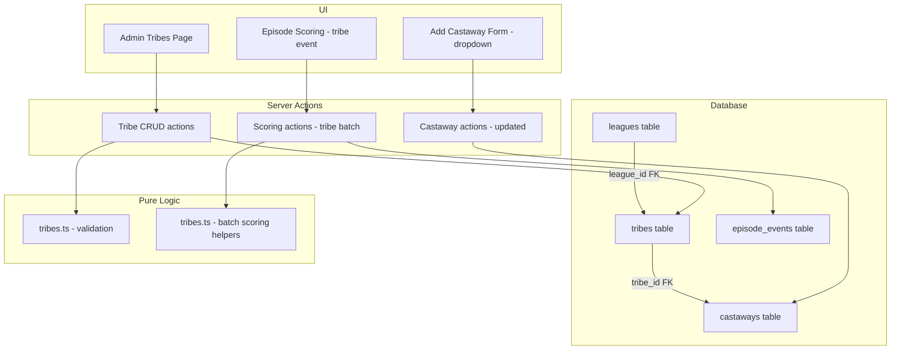
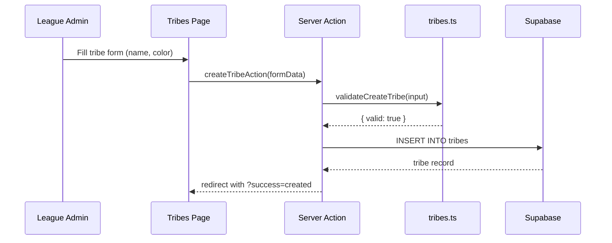
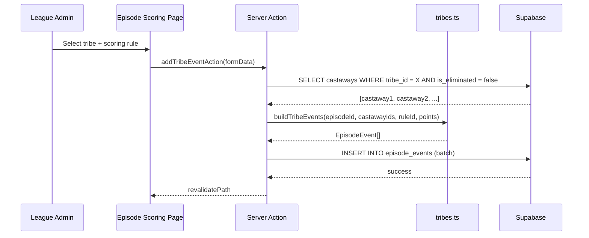

# Design Document: Tribe Management

## Overview

Tribes become first-class entities in the Fantasy Survivor application. Instead of a free-text `tribe` column on `castaways`, tribes are stored in a dedicated `tribes` table scoped to a league. League admins can create, edit, and delete tribes. The castaway form uses a dropdown to select an existing tribe. Episode scoring gains a "tribe event" capability that applies a scoring event to every castaway in a selected tribe at once.

This design covers the database migration (including data backfill), RLS policies, server actions, pure validation logic, UI components, and the tribe-based batch scoring workflow.

## Architecture



## Sequence Diagrams

### Tribe CRUD Flow



### Tribe-Based Batch Scoring Flow



## Components and Interfaces

### Component 1: Tribe Validation (`src/lib/tribes.ts`)

**Purpose**: Pure validation and helper logic for tribes — no Supabase calls.

**Interface**:
```typescript
export interface Tribe {
  id: string;
  league_id: string;
  name: string;
  color: string | null;
  created_at: string;
}

export interface CreateTribeInput {
  name: string;
  color: string;
}

export interface CreateTribeResult {
  valid: boolean;
  error?: string;
}

export function validateCreateTribe(input: CreateTribeInput): CreateTribeResult;
export function validateUpdateTribe(input: CreateTribeInput): CreateTribeResult;
export function buildTribeEvents(
  episodeId: string,
  castawayIds: string[],
  ruleId: string,
  points: number
): Array<{ episode_id: string; castaway_id: string; scoring_rule_id: string; points: number }>;
```

**Responsibilities**:
- Validate tribe name is non-empty and within length limits
- Validate color is a valid hex color or empty
- Build batch event records for tribe-based scoring

### Component 2: Tribe CRUD Actions (`src/app/league/[id]/admin/tribes/actions.ts`)

**Purpose**: Server actions for creating, updating, and deleting tribes.

**Interface**:
```typescript
export async function createTribeAction(formData: FormData): Promise<void>;
export async function updateTribeAction(formData: FormData): Promise<void>;
export async function deleteTribeAction(formData: FormData): Promise<void>;
```

**Responsibilities**:
- Verify admin authorization via `requireLeagueAdmin`
- Validate input using `validateCreateTribe` / `validateUpdateTribe`
- Perform Supabase insert/update/delete
- Prevent deletion of tribes that still have castaways assigned
- Redirect with success/error query params

### Component 3: Tribe-Based Scoring Action (`src/app/league/[id]/admin/episode/[num]/actions.ts`)

**Purpose**: New server action for applying a scoring event to all active castaways in a tribe.

**Interface**:
```typescript
export async function addTribeEventAction(formData: FormData): Promise<void>;
```

**Responsibilities**:
- Verify admin authorization
- Fetch all non-eliminated castaways in the selected tribe
- Use `buildTribeEvents` to construct event records
- Batch insert into `episode_events`

### Component 4: Admin Tribes Page (`src/app/league/[id]/admin/tribes/page.tsx`)

**Purpose**: UI for managing tribes within a league.

**Responsibilities**:
- Display list of existing tribes with name and color swatch
- Form to create a new tribe
- Inline edit/delete for each tribe
- Show castaway count per tribe

### Component 5: Updated Add Castaway Form (`src/components/add-castaway-form.tsx`)

**Purpose**: Replace free-text tribe input with a dropdown of existing tribes.

**Responsibilities**:
- Fetch tribes for the league and pass as props
- Render a `<select>` with tribe options
- Submit `tribe_id` instead of `tribe` text

### Component 6: Tribe Scoring UI (`src/components/tribe-event-form.tsx`)

**Purpose**: Form on the episode scoring page for adding events to an entire tribe.

**Responsibilities**:
- Dropdown to select a tribe
- Dropdown to select a scoring rule
- Points field (auto-filled from rule default)
- Submit triggers `addTribeEventAction`

## Data Models

### Tribes Table

```sql
CREATE TABLE tribes (
  id UUID PRIMARY KEY DEFAULT gen_random_uuid(),
  league_id UUID NOT NULL REFERENCES leagues(id) ON DELETE CASCADE,
  name TEXT NOT NULL,
  color TEXT,
  created_at TIMESTAMPTZ NOT NULL DEFAULT now(),
  UNIQUE(league_id, name)
);
```

**Validation Rules**:
- `name` must be non-empty, trimmed, max 50 characters
- `name` must be unique within a league
- `color` must be null or a valid 6-digit hex color (e.g., `#FF5733`)

### Castaways Table Change

```sql
-- Add tribe_id column
ALTER TABLE castaways ADD COLUMN tribe_id UUID REFERENCES tribes(id) ON DELETE SET NULL;

-- After data migration, drop old column
ALTER TABLE castaways DROP COLUMN tribe;
```

### TypeScript Types

```typescript
export interface Tribe {
  id: string;
  league_id: string;
  name: string;
  color: string | null;
  created_at: string;
}

export interface Castaway {
  id: string;
  league_id: string;
  name: string;
  tribe_id: string | null;  // Changed from tribe: string | null
  photo_url: string | null;
  is_eliminated: boolean;
  eliminated_episode: number | null;
  created_at: string;
}
```

## Algorithmic Pseudocode

### Migration Algorithm

```typescript
// Step 1: Create tribes table
// Step 2: For each league, extract distinct tribe names from castaways
// Step 3: Insert tribe records
// Step 4: Add tribe_id column to castaways
// Step 5: UPDATE castaways SET tribe_id = tribes.id WHERE castaways.tribe = tribes.name AND castaways.league_id = tribes.league_id
// Step 6: Drop old tribe column

async function migrateTribeData(): Promise<void> {
  // Create tribes table (DDL)
  
  // Backfill: create tribe records from existing data
  // INSERT INTO tribes (league_id, name)
  // SELECT DISTINCT league_id, tribe FROM castaways WHERE tribe IS NOT NULL AND tribe != ''
  
  // Add FK column
  // ALTER TABLE castaways ADD COLUMN tribe_id UUID REFERENCES tribes(id)
  
  // Populate FK
  // UPDATE castaways c SET tribe_id = t.id
  // FROM tribes t WHERE c.league_id = t.league_id AND c.tribe = t.name
  
  // Drop old column
  // ALTER TABLE castaways DROP COLUMN tribe
}
```

### Tribe Validation

```typescript
function validateCreateTribe(input: CreateTribeInput): CreateTribeResult {
  const name = input.name?.trim() ?? "";
  
  if (name.length === 0) {
    return { valid: false, error: "Tribe name is required." };
  }
  
  if (name.length > 50) {
    return { valid: false, error: "Tribe name must be 50 characters or fewer." };
  }
  
  const color = input.color?.trim() ?? "";
  if (color.length > 0 && !/^#[0-9A-Fa-f]{6}$/.test(color)) {
    return { valid: false, error: "Color must be a valid hex color (e.g., #FF5733)." };
  }
  
  return { valid: true };
}
```

### Build Tribe Events

```typescript
function buildTribeEvents(
  episodeId: string,
  castawayIds: string[],
  ruleId: string,
  points: number
): Array<{ episode_id: string; castaway_id: string; scoring_rule_id: string; points: number }> {
  return castawayIds.map((castawayId) => ({
    episode_id: episodeId,
    castaway_id: castawayId,
    scoring_rule_id: ruleId,
    points,
  }));
}
```

## Key Functions with Formal Specifications

### Function 1: validateCreateTribe()

```typescript
function validateCreateTribe(input: CreateTribeInput): CreateTribeResult
```

**Preconditions:**
- `input` is defined
- `input.name` is a string (may be empty)
- `input.color` is a string (may be empty)

**Postconditions:**
- Returns `{ valid: true }` if and only if name is non-empty after trimming, ≤50 chars, and color is either empty or matches `#[0-9A-Fa-f]{6}`
- Returns `{ valid: false, error: string }` otherwise
- No side effects

### Function 2: buildTribeEvents()

```typescript
function buildTribeEvents(
  episodeId: string,
  castawayIds: string[],
  ruleId: string,
  points: number
): Array<{ episode_id: string; castaway_id: string; scoring_rule_id: string; points: number }>
```

**Preconditions:**
- `episodeId` is a non-empty string
- `castawayIds` is an array of strings (may be empty)
- `ruleId` is a non-empty string
- `points` is a finite number

**Postconditions:**
- Returns an array with exactly `castawayIds.length` elements
- Each element has the same `episode_id`, `scoring_rule_id`, and `points`
- Each element has a unique `castaway_id` from the input array
- No side effects on input arrays

**Loop Invariants:**
- For all processed elements: `result[i].castaway_id === castawayIds[i]`

### Function 3: deleteTribeAction()

```typescript
async function deleteTribeAction(formData: FormData): Promise<void>
```

**Preconditions:**
- User is authenticated and is the league admin
- `formData` contains `league_id` and `tribe_id`

**Postconditions:**
- If tribe has castaways assigned, redirects with error (no deletion)
- If tribe has no castaways, deletes the tribe record
- Revalidates the tribes page path

## Example Usage

```typescript
// Creating a tribe
const input: CreateTribeInput = { name: "Tika", color: "#3B82F6" };
const result = validateCreateTribe(input);
// result = { valid: true }

// Invalid tribe
const bad: CreateTribeInput = { name: "", color: "" };
const badResult = validateCreateTribe(bad);
// badResult = { valid: false, error: "Tribe name is required." }

// Building tribe events for scoring
const events = buildTribeEvents(
  "episode-uuid-1",
  ["castaway-1", "castaway-2", "castaway-3"],
  "rule-immunity",
  3
);
// events = [
//   { episode_id: "episode-uuid-1", castaway_id: "castaway-1", scoring_rule_id: "rule-immunity", points: 3 },
//   { episode_id: "episode-uuid-1", castaway_id: "castaway-2", scoring_rule_id: "rule-immunity", points: 3 },
//   { episode_id: "episode-uuid-1", castaway_id: "castaway-3", scoring_rule_id: "rule-immunity", points: 3 },
// ]

// Castaway form now submits tribe_id
// <select name="tribe_id">
//   <option value="">No tribe</option>
//   <option value="tribe-uuid-1">Tika</option>
//   <option value="tribe-uuid-2">Reba</option>
// </select>
```

## Error Handling

### Error Scenario 1: Duplicate Tribe Name

**Condition**: Admin creates a tribe with a name that already exists in the league
**Response**: Database UNIQUE constraint violation caught; redirect with error "A tribe with this name already exists."
**Recovery**: Admin corrects the name and resubmits

### Error Scenario 2: Delete Tribe with Assigned Castaways

**Condition**: Admin attempts to delete a tribe that has castaways assigned to it
**Response**: Server action checks castaway count before deletion; redirects with error "Cannot delete a tribe that has castaways assigned. Reassign them first."
**Recovery**: Admin reassigns castaways to another tribe, then deletes

### Error Scenario 3: Tribe Event on Finalized Episode

**Condition**: Admin attempts to add a tribe event to a finalized episode
**Response**: Server action checks `is_finalized` flag; redirects with error "Cannot add events to a finalized episode."
**Recovery**: Admin un-finalizes the episode first

### Error Scenario 4: Tribe Event with No Active Castaways

**Condition**: Admin selects a tribe that has no active (non-eliminated) castaways
**Response**: Server action returns early with error "No active castaways in this tribe."
**Recovery**: Admin selects a different tribe or restores castaways

## Testing Strategy

### Unit Testing Approach

Test `src/lib/tribes.ts` pure functions:
- `validateCreateTribe` with valid/invalid inputs
- `validateUpdateTribe` with valid/invalid inputs
- `buildTribeEvents` with various castaway arrays

### Property-Based Testing Approach

**Property Test Library**: fast-check

Properties to test:
1. Tribe name validation: any non-empty trimmed string ≤50 chars passes
2. Color validation: any string matching `#[0-9A-Fa-f]{6}` passes
3. `buildTribeEvents` output length equals input castaway count
4. `buildTribeEvents` preserves all castaway IDs
5. Round-trip: tribe validation accepts all names it would produce from valid input

### Integration Testing Approach

- Tribe CRUD operations against Supabase
- Migration correctness: existing tribe text values become proper FK references
- RLS policies: non-admin users cannot modify tribes
- Tribe-based scoring: events created for all tribe members

## Security Considerations

### RLS Policies for Tribes Table

Following the same pattern as other league-scoped tables:

```sql
-- Anyone in the league can read tribes
CREATE POLICY "League members can view tribes"
  ON tribes FOR SELECT
  USING (
    league_id IN (
      SELECT league_id FROM league_members WHERE user_id = auth.uid()
    )
  );

-- Only league admin can insert/update/delete
CREATE POLICY "League admin can manage tribes"
  ON tribes FOR ALL
  USING (
    league_id IN (
      SELECT id FROM leagues WHERE admin_id = auth.uid()
    )
  )
  WITH CHECK (
    league_id IN (
      SELECT id FROM leagues WHERE admin_id = auth.uid()
    )
  );
```

### Server-Side Authorization

All tribe mutation actions use `requireLeagueAdmin(leagueId)` to verify the current user is the league admin before performing any database operations.

## Performance Considerations

- Tribes per league is small (typically 2-4), so no pagination needed
- The tribe-based scoring batch insert uses a single `INSERT ... VALUES` statement rather than individual inserts
- Index on `castaways.tribe_id` for efficient lookups when scoring by tribe
- The migration backfill uses set-based SQL operations (no row-by-row processing)

## Dependencies

- Supabase PostgreSQL (existing)
- `@supabase/ssr` for server/client clients (existing)
- shadcn/ui `Select` component for tribe dropdown (existing in project)
- fast-check for property-based tests (existing)
- No new external dependencies required
